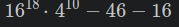
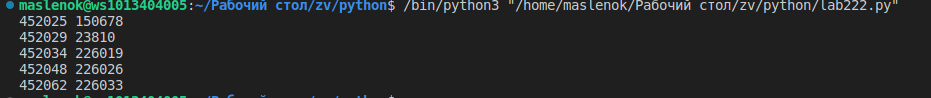

# Лабораторная работа 2
## Задача 1
Настя составляет 6-буквенные коды из букв Н, А, С, Т, Я. Каждая допустимая гласная буква может входить в код не более одного раза. Сколько кодов может составить Настя?
## Решение задачи

## Задача 2
Значение арифметического выражения  записали в системе счисления с основанием 4. Сколько цифр 3 содержится в этой записи?
## Решение задачи

## Задача 3
Пусть M  — сумма минимального и максимального натуральных делителей целого числа, не считая единицы и самого числа. Если таких делителей у числа нет, то считаем значение M равным нулю. Найдите целые числа, большие 452 021, в порядке возрастания, такие, для которых значение 

M при делении на 7 даёт в остатке 3. Вывести первые 5 найденных чисел и соответствующие им значения 
M.
Формат вывода: для каждого из 5 таких найденных чисел в отдельной строке сначала выводится само число, затем  — значение 
M. Строки выводятся в порядке возрастания найденных чисел.
## Решение задачи

## Список источников
 1. [Itertools в Python - Хабр](https://habr.com/ru/companies/otus/articles/529356/)
 2. [itertools — Functions creating iterators for efficient looping](https://docs.python.org/3/library/itertools.html)
 3. [Итерируем правильно: 20 приемов использования в Python модуля itertools](https://proglib.io/p/iteriruemsya-pravilno-20-priemov-ispolzovaniya-v-python-modulya-itertools-2020-01-03)
