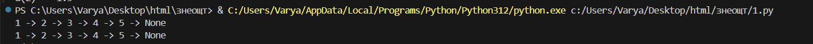
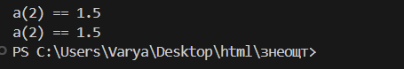

# Задание 1
Напишите две функции для решения задач своего варианта - с использованием рекурсии и без.
## Описание
Написана функция для преобразования вложенных списков в строку. 
## Решение
``` python
def to_str(nested_list):
    result = []
    while nested_list:
        element = nested_list.pop()
        if isinstance(element, list):
            nested_list.extend(element)
        else:
            result.append(str(element))
    return ' -> '.join(reversed(result)) + ' -> None'
print(to_str([1, [2, [3, [4, [5]]]]]))

def rec(lst):
    if isinstance(lst, list):
        rest = ''
        for n in lst:
            if n:
                rest += rec(n).replace("None",'')
        return rest + 'None'
    return  str(lst) + ' -> '
print(rec([1, [2, [3, [4, [5]]]]]))


```
## Скриншот

# Задание 2
Написана функция для расчёта элемента последовательности (рекурсией и без).
## Решение
``` python
def calc_rec(n):
    if n == 0 or n == 1:
        return 1
    return calc_rec(n - 2) + (calc_rec(n - 1) / (2 ** (n - 1)))
print(f'a(2) == {calc_rec(2)}')


def calc(n):
    if n == 0 or n == 1:
        return 1
    a1=1
    a2=1
    for i in range(2,n+1):
        current=a1+(a2/(2**(i-1)))
        a1=a2
        a2=current
    return a2
print(f'a(2) == {calc(2)}')
```
## Скриншот

## Список используемых источников
1.[Самоучитель по Python для начинающих. Часть 13: Рекурсивные функции](https://proglib.io/p/samouchitel-po-python-dlya-nachinayushchih-chast-13-rekursivnye-funkcii-2023-01-23)\
2.[Как работает рекурсия – объяснение в блок-схемах и видео](https://habr.com/ru/articles/337030/)\
3.[Recursion in Programming - Full Course - freeCodeCamp.org](https://www.youtube.com/watch?v=IJDJ0kBx2LM)