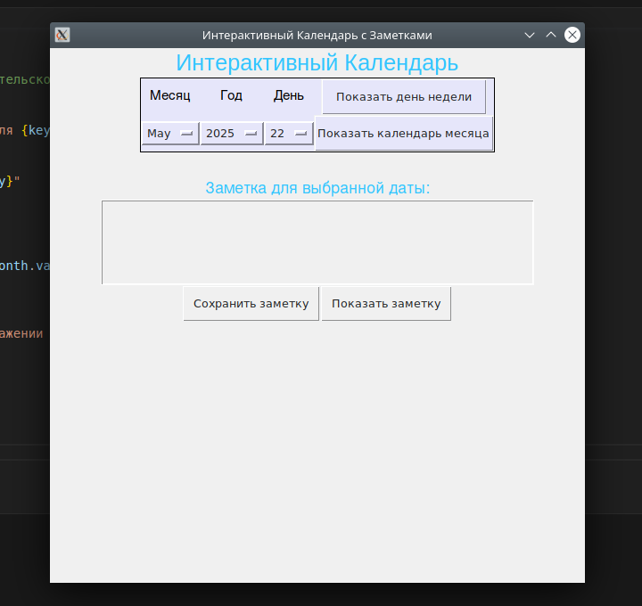

# Задание
Реализуйте приложение с GUI (приложения-игры допускается делать с использованием TUI-пакетов) по своему варианту. Можно изменить задание на собственную тему, согласовав с преподавателем. Требования:

приложение должно быть написано с применением ОО парадигмы
исключительные ситуации должны обрабатываться с использованием собственных исключений
GUI/TUI фреймворки не должны повторяться в группе

## Объяснение
Написал код GUI - Guizero, календарь который показывает день и дату и тд
## Решение
![image]
## Скриншот
![image]
## Список литературы
[chat.qwen.ai](https://chat.qwen.ai/c/0cb0994f-4c6c-4887-be41-0408d99a3969)