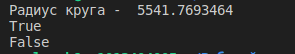
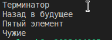
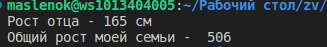
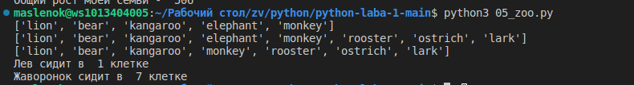
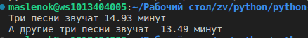
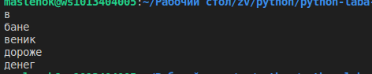
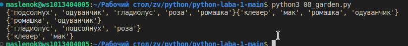
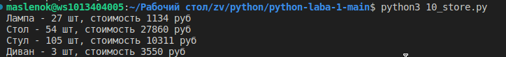

 # Лабораторная работа №1
 ## задание 1
 Составить словать словарей расстояние междуними используя данную формулу:
 $distances =\sqrt{((x_1 - x_2) ^ 2 + (y1 - y_2) ^2 )}$
 ## результат вычислений
 
 ## Задание 2
 Первая часть задани вывести на кносоль значение площади круга с точности до 4 -х знаков после хапятой 
 формула для нахождения плозщади круга:
 $S_x + R^2 * \pi$
 Вторая часть задания даны координаты точи если точка лежит внутри самого кргуа [центр в начале координат (0,0) radius = 42], вывести True or False если точка лежит на круге.
 ## Результат вычислений
 
 ## задание 4
 Выведите на консоль с помощью индексации строки:
 первый фильм
 последний
 второй
 второй с конца
 ## результат вычислений
 
 ## Задание 5
 Создать список элементов (членов семейства) и список приблизительного роста , Вывести в консоль рост  отца и общий рост семьи
 ## результат вычислений
 
 ## Задание 6
 список животных в зоопарке, посадите медведя между львом и кенгуку и выведите список на консоль добавьте птиц из списка в последние клетки зоопарка и выведите на консоль уберите слона и выведите спмсок на консоль. в какой клетке сидит лев и жавронок. номера при выводе должны быть поятным порстому человеку
 ## результат вычислений
 
 ## Задание 7
 дан список песен группы deepeche mode , распечатать общее время звучания трех песен halo, enjoy the silence and clean в формате три песни звучат xxx.xx минут , и распечатать общее время звучания других трех песен : sweetest perfection polcy of truth  and blue dress в формате другие три песни звучат так xxx минут
 ## результат вычислений 
 
 ## задание 8
 дано зашифрованное сообщение нужно его расшифровать и вывести на консоль в удобочитательном виде.
 ## результат вычислений
 
 ## Задание 9
 дано 2 списка цветов растуших в саду и на лугу. создать множество и вывести на консоль все виды цветов которые растутт и там и там которые растут в саду но не растут на лугу но не растут в саду.
 ## результат вычислений
 
 ## задание 10
 дан словарь магазинов с распродажамисоздать словаь цен на подукты следующего вида
 ## результат вычислений
 
 ## Список источников
 1. [Markdown cheat sheet](https://www.markdownguide.org/cheat-sheet/)
 2. [Подробная информация ооб обратных срезах](https://cick.ru/MFEFS)

